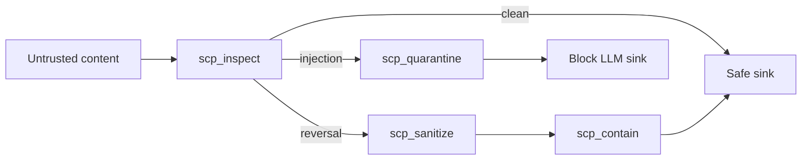

# SCP — Secure Contain Protect

Inspect, sanitize, contain, and quarantine unknown or potentially hazardous content before persisting or feeding to LLM. MCP server for agent-native content safety.

**Guard** in the Guard–Guide–Build taxonomy. Per OWASP LLM01/LLM06.

[](https://github.com/ManintheCrowds/SCP/actions/workflows/ci.yml)

## Problem → Solution → Impact

- **Problem:** Untrusted tool output and user content can carry prompt injection, credential leaks, and override phrases into LLM context.
- **Solution:** Tiered pipeline (inspect → sanitize → contain → quarantine) exposed as MCP tools; optional promptfoo eval harness (16/16 tier probes).
- **Impact:** OWASP LLM01/LLM06-aligned guardrail for agent stacks; composes with [OpenHarness](https://github.com/ManintheCrowds/OpenHarness) contract v1.

## Tech stack

Python 3.10+, MCP, optional Ollama semantic judge (off by default in CI), promptfoo for offline evals.

## Architecture



## Pipeline

1. **Inspect** — Classify content: `injection` | `reversal` | `clean`
2. **Sanitize** — Strip hidden Unicode, redact override phrases (when tier is reversal)
3. **Contain** — Wrap content so it is treated as data: Markdown uses a fence at least as long as the longest run of backticks in the payload (info string `scp`); XML uses a single `<data>` element with body in CDATA (with `]]>` safely split). Unknown `wrapper` values raise `ValueError`.
4. **Quarantine** — Move suspect content to isolated storage (when tier is injection)

## Tier-Based Actions

| Tier | Action |
|------|--------|
| injection | Block; do not persist or feed to LLM; optionally quarantine |
| reversal | Sanitize, then contain |
| clean | Pass through |

## MCP Tools

- `scp_inspect(content, context?)` — Classify without changing content
- `scp_sanitize(content, mode?)` — Strip/neutralize known bad patterns
- `scp_contain(content, wrapper?)` — Wrap content as data
- `scp_quarantine(content, reason, source)` — Isolate suspect content
- `scp_list_quarantine()` — List quarantine entries
- `scp_purge_quarantine(quarantine_id?, older_than_days?)` — Purge quarantine
- `scp_validate_output(content, tool_name?)` — Check tool output before use
- `scp_mask_secrets(content)` — Redact credentials/PII
- `scp_run_pipeline(content, sink, options?)` — One-shot for high-risk sinks

## Install

```bash
pip install -e .
# or: pip install mcp
```

## Run MCP Server

```bash
python -m scp.scp_mcp
```

Add to `mcp.json`:

```json
{
  "mcpServers": {
    "scp": {
      "command": "python",
      "args": ["-m", "scp.scp_mcp"]
    }
  }
}
```

Set `PYTHONPATH` or install the package so `scp` is importable.

## Environment

| Variable | Description |
|----------|-------------|
| `SCP_QUARANTINE_DIR` | Quarantine storage path (default: `./scp_quarantine`) |
| `SCP_QUARANTINE_MAX_CONTENT_BYTES` | Max UTF-8 bytes per quarantined payload (default `1048576` = 1 MiB; hard cap 50 MiB) |
| `SCP_QUARANTINE_MAX_TOTAL_BYTES` | Max total on-disk bytes for all quarantine pairs under `SCP_QUARANTINE_DIR` (default `104857600` = 100 MiB) |
| `SCP_QUARANTINE_RETENTION_DAYS_ON_WRITE` | If set (positive int), delete quarantine entries whose `.json` is older than this many days before each new write |
| `SCP_QUARANTINE_EVICT_OLDEST_ON_PRESSURE` | When `1` (default), delete oldest-by-mtime entries if a new write would exceed the total cap; set `0` to fail with an error instead |
| `OLLAMA_BASE_URL` | For semantic judge: **origin only** (default `http://localhost:11434`). Allowed hosts: `localhost`, `127.0.0.1`, `::1`, plus comma-separated `OLLAMA_ALLOWED_HOSTS`. No path, query, or userinfo. HTTP redirects to another host are not followed. |
| `OLLAMA_ALLOWED_HOSTS` | Optional extra hostnames/IPs (comma-separated, case-insensitive) allowed for `OLLAMA_BASE_URL` |
| `OLLAMA_URL_STRICT` | Set to `1` to reject names that resolve to private or link-local addresses (mitigates some SSRF/DNS cases) |
| `OLLAMA_MODEL` | For semantic judge (default: `llama3.2`) |
| `OLLAMA_API_KEY` | Optional bearer token for Ollama (sent as `Authorization: Bearer …`; never put secrets in the URL) |
| `SCP_SEMANTIC_JUDGE` | Set to `1` to enable semantic judge globally |
| `SCP_MAX_INPUT_CHARS` | Maximum string length for `inspect`, `classify`, `sanitize`, `contain`, and `mask_secrets` (default `2000000`; hard ceiling `50000000`) |

**Trust:** Point Ollama only at hosts you control. On shared runners or CI, keep the semantic judge off unless required; use firewall rules so the process cannot reach sensitive internal subnets unless intended.

## Threat Registry

Patterns in `scp_threat_registry.json`: power_words, multilingual_override, jailbreak_nicknames, mythic_framing, bitcoin_inscription_override. Version bump on change.

## Test harness matrix

| Where | Suite | What it validates |
|-------|--------|-------------------|
| This repo (CI job `contract`) | `pytest tests/test_mcp_contract_v1.py` | MCP tool **names** vs OpenHarness v1 set |
| This repo (CI job `contract`) | `pytest tests/test_contract_document_hash.py` | Vendored [`docs/contracts/scp_mcp_v1.md`](docs/contracts/scp_mcp_v1.md) SHA-256 (sync with OpenHarness) |
| This repo (CI job `promptfoo-eval`) | `examples/promptfoo` / `npx promptfoo eval` | `scp_utils.inspect` **tier** labels (offline, no API keys) |
| **portfolio-harness** | Workflow `scp_pipeline_regression` + `daggr_workflows/tests/test_scp_pipeline_golden.py` | `run_pipeline` / Daggr alignment (install this repo with `pip install -e` in that workspace) |

## CI and quarantine

- **GitHub Actions:** `contract` (Python matrix + pytest) and `promptfoo-eval` (Node 22, `examples/promptfoo`).
- **Quarantine:** Default directory `scp_quarantine/` (or `SCP_QUARANTINE_DIR`) must not be committed—listed in [`.gitignore`](.gitignore). Writes enforce per-entry and total byte limits (see environment table); optional age-based purge and oldest-first eviction reduce disk exhaustion from repeated or oversized blocked payloads.

## Documentation

- [docs/OPENHARNESS_CONTRACT.md](docs/OPENHARNESS_CONTRACT.md) — Normative MCP contract sync and `CONTRACT_HASH`
- [docs/contracts/scp_mcp_v1.md](docs/contracts/scp_mcp_v1.md) — Vendored OpenHarness contract (verified by hash test)
- [docs/REFERENCE.md](docs/REFERENCE.md) — Threat model, tier definitions, over-sanitization allowlist
- [docs/RED_TEAM_PROMPTS.md](docs/RED_TEAM_PROMPTS.md) — Self-test prompts and expected behavior
- [docs/INTEGRATION.md](docs/INTEGRATION.md) — SCP as guardrail: verification before persist, high-risk sinks
- [docs/LEARNINGS_PROMPTFOO.md](docs/LEARNINGS_PROMPTFOO.md) — promptfoo integration, CI, and inspection results
- [examples/README.md](examples/README.md) — Daggr + Gradio integration example; [examples/promptfoo](examples/promptfoo/README.md) — offline promptfoo eval (tier probes)

## FAQ: PDFs and binary files

SCP tools take **text** (`content: str`). **PDFs and other binaries are not scanned directly.** For documents:

1. Extract text (e.g. `pypdf`, `pdftotext`, `pymupdf`).
2. Run `scp_inspect` / `scp_run_pipeline` on the extracted text before LLM or handoff sinks.
3. Use OS antivirus or equivalent on the original files separately (malware is out of scope for SCP).

See also: `local-proto` docs `HUMAN_WELLBEING_CORPUS.md` for a full private-PDF pipeline (provenance, chunks, optional RAG).

## Guardrail

SCP has no shutdown, suicide, or self-termination commands. SCP inspects, sanitizes, contains, and quarantines content—it does not self-destruct.

## Roadmap

- [ ] GitHub topics: `mcp`, `llm-security`, `prompt-injection`
- [ ] Shared threat registry narrative ([SCP-R2](https://github.com/ManintheCrowds/MiscRepos/blob/main/docs/portfolio/decision-cards/SCP-R2.md) — public eval shell)
- [ ] MCP Registry listing when governance doc is ready

## Red-team eval (SCP-R2)

```bash
pip install -e .
cd examples/promptfoo
npx promptfoo eval
```

See [examples/promptfoo/README.md](examples/promptfoo/README.md) and [docs/LEARNINGS_PROMPTFOO.md](docs/LEARNINGS_PROMPTFOO.md).

## License

MIT — see [LICENSE](LICENSE).
