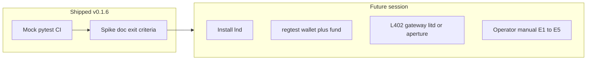

# SCP-ANT1 P1b — L402 payment edge spike

**decision_id:** `scp-ant1-p1b-l402`  
**supersedes:** P1 402 stub (metadata only)  
**version target:** v0.1.6  
**spike_status:** `regtest_passed` (2026-07-02 — automated E1–E5 via [MiscRepos `antigen_l402_regtest_e2e.ps1`](../../../MiscRepos/local-proto/scripts/antigen_l402_regtest_e2e.ps1))

## Payment rail (locked)

**L402 macaroon+invoice only** for P1b v0. Cashu NUT-24 deferred to P2 (anonymity-sensitive mode per ANT1 §11.6).

| ADR cell | Risk | Compensating control |
|----------|------|----------------------|
| B monetization | Yellow | Paid body on HTTPS only; nostr announcement = hash+summary |
| C Sybil/poison | Yellow | Allowlist + hash verify + quarantine; payment ≠ attestation |
| D privacy | Yellow | Audit: bundle id, issuer fingerprint, hash, invoice_hint — no payload body |

## Operator flow

1. `discover` → announcement with `payload_urls[0]` and `x` hash tag.
2. `fetch` (no token) → server returns **402** + `WWW-Authenticate: L402 macaroon="...", invoice="lnbc..."`.
3. MCP/CLI surfaces `l402` metadata — **no auto-spend** (ANT1 §11.1).
4. Operator pays invoice via lncli / Zeus / treasury (human gate).
5. Operator retries with `SCP_ANTIGEN_L402_TOKEN` or `--l402-token` = `macaroon:preimage`.
6. Client sends `Authorization: L402 <macaroon>:<preimage>` → **200** → sha256 verify → `import_bundle` quarantine only.

**Logging:** 402 MCP/CLI JSON intentionally includes `macaroon` and `invoice` so the operator can pay. Do not log tool stdout or pipe 402 responses to git-tracked files.

## Header formats

**Challenge (402):**

```
WWW-Authenticate: L402 macaroon="<base64>", invoice="lnbc..."
```

**Retry (200 path):**

```
Authorization: L402 <macaroon>:<preimage>
```

Module: `src/scp/antigen_l402.py` — `parse_www_authenticate_l402`, `normalize_l402_token`, `format_authorization_header`.

## API seam

- `fetch_payload(url, hash, *, l402_token=None)` — extend P1 stub; no separate `complete_l402_fetch`.
- `import_from_announcement(..., l402_token=None)` — pass-through; env `SCP_ANTIGEN_L402_TOKEN` fallback.
- MCP `scp_antigen_fetch(..., l402_token=None)` — pre-supplied token only.
- CLI `fetch` subcommand + `discover --fetch --l402-token`.

**Rejected:** `--pay`, `scp_antigen_pay_fetch`, MCP wallet integration.

## Test strategy (CI)

| Test | Scope |
|------|-------|
| Parse WWW-Authenticate | Unit — quoted macaroon + invoice |
| 402 without token | `FetchError(payment_required)` + parsed fields |
| 402 → retry → 200 | Mock two GETs; hash verify |
| Still 402 after token | `FetchError` |
| import quarantine | Paid fetch → accepted quarantine, no merge |
| Audit | `fetch_l402_challenge`, `fetch_l402_retry`, `fetch_ok` — no token in logs |

**No mainnet in CI.** Mock-only.

## Regtest spike — pre-flight (org-intent hb-1..hb-5)

Read `org-intent-spec/examples/org-intent.bitcoin-inspired.json` before any Lightning work. **ESCALATE** on conflict.

| HB | Check |
|----|-------|
| hb-1 | No principle conflict: operator pays, agent never spends |
| hb-2 | No complicity: antigen fetch is allowlisted issuers only |
| hb-3 | Invoice/macaroon from trusted test server only |
| hb-4 | Spend is operator wallet, not agent delegation |
| hb-5 | Document that regtest ≠ mainnet; mainnet requires `APPROVAL_NEEDED` |

## Regtest spike — exit criteria (manual E1–E6)

Not required for CI green or v0.1.6 tag. Record PASS/FAIL per row when LND is available.

| # | Criterion | Evidence | Status |
|---|-----------|----------|--------|
| E1 | `fetch` without token → 402 + parsed `macaroon`/`invoice` | CLI/MCP JSON output | pass |
| E2 | Operator pays regtest invoice manually | `lncli payinvoice` preimage (**do not log**) | pass |
| E3 | Retry with `--l402-token` → 200 + hash match | `fetch_ok` audit event | pass |
| E4 | `import_from_announcement` → quarantine, **no merge** | `import_accepted`; no `merge_applied` | pass |
| E5 | Audit log has `invoice_hint`, no macaroon/preimage/body | `antigen_audit.jsonl` review | pass |
| E6 | Full pytest still green | `136 passed`, 1 skipped (regtest closure) | pass |

When E1–E5 all pass, set `spike_status: regtest_passed` and add MiscRepos `decision-log` entry `scp-ant1-p1b-l402-regtest`.

## Future LND setup plan

**Implemented (v0.1.7+):** Docker Compose + runbook — [ANTIGEN_L402_REGTEST_RUNBOOK.md](../../../MiscRepos/local-proto/docs/ANTIGEN_L402_REGTEST_RUNBOOK.md). **Automated closure:** `.\local-proto\scripts\antigen_l402_regtest_e2e.ps1 -ConfirmRegtest` (E1–E5 + pytest). Recorded `scp-ant1-p1b-l402-regtest` 2026-07-02.

Staged path for this Windows host. Distinct from Bitcoin Core Stealth regtest in MiscRepos `local-proto/docs/STEALTH_E2E_SECURE_RUNBOOK.md` (on-chain only; no L402).



| Step | Action | Reference |
|------|--------|-----------|
| F1 | Install stack via Docker Compose | [ANTIGEN_L402_REGTEST_RUNBOOK.md](../../../MiscRepos/local-proto/docs/ANTIGEN_L402_REGTEST_RUNBOOK.md) |
| F2 | `run_antigen_l402_regtest.ps1` — regtest wallet + fund | same |
| F3 | Aperture + backend serve fixture payload | `local-proto/docker/antigen-l402-regtest/` |
| F4 | Run E1–E5 checklist; record PASS in MiscRepos `decision-log` | `decision_id: scp-ant1-p1b-l402-regtest` |
| F5 | Optional: `SCP_ANTIGEN_L402_INTEGRATION=1` skipped live pytest (mirror nostr pattern) | only after F1–F4 |

MiscRepos backlog: **SCP-ANT1-LND** — see `.cursor/state/pending_tasks.md`.

## Invariants

- Payment ≠ attestation — paid body still quarantine.
- No secrets in git; never log `l402_token` or full macaroon.
- `scp_mcp.py` (core OpenHarness contract) unchanged.

## References

- [ANTIGEN_P1_NOSTR.md](ANTIGEN_P1_NOSTR.md)
- MiscRepos `docs/CASHU_L402_REFERENCE.md`
- MiscRepos `docs/superpowers/specs/2026-04-12-scp-antigen-l402-design.md` §11.1, §11.4, §11.6
- MiscRepos `org-intent-spec/examples/org-intent.bitcoin-inspired.json` (hb-1..hb-5)
