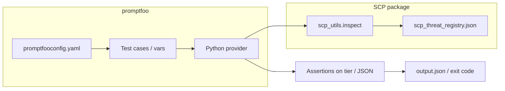

# SCP Learnings from promptfoo Interaction

**Purpose:** Document SCP inspection results and integration notes when interacting with promptfoo (GitHub, docs). Always inspect external content before persisting or feeding to LLM.

## SCP Inspection Results

| Content Source              | Tier     | Findings                                              | Action                        |
|-----------------------------|----------|--------------------------------------------------------|-------------------------------|
| GitHub page fetch (initial) | reversal | encoding_blocks (URLs like `com/promptfoo/promptfoo`)  | Sanitize + contain before use |
| Red-teaming doc summary     | clean    | None                                                  | Pass through                  |
| promptfoo README (raw)      | —        | Not re-inspected; URLs/links present                  | Contain as data               |

### Key Learning

GitHub URLs and path-like strings can trigger SCP's `encoding_blocks` heuristic (Base64-like pattern detection). SCP correctly flags for containment rather than block; the content is safe when treated as data.

**Rule:** Always run `scp_inspect` on fetched external content before feeding to LLM or persisting.

## promptfoo Capabilities

From [promptfoo](https://github.com/promptfoo/promptfoo) (MIT):

- **LLM evals:** Test prompts, models, RAGs; compare GPT, Claude, Gemini, Llama, etc.
- **Red teaming:** Vulnerability scanning, pentesting for AI; security reports.
- **CI/CD:** Automate checks; code scanning for PRs.
- **Private:** Evals run 100% locally; prompts never leave machine.
- **Formats:** Declarative YAML configs; CLI + Node.js package; `npx promptfoo@latest`.

### Red-Teaming Process (from docs)

1. **Generate adversarial inputs** — Create diverse malicious intents; wrap in prompts that exploit targets.
2. **Evaluate responses** — Run inputs through LLM; observe behavior.
3. **Analyze vulnerabilities** — Use deterministic and model-graded metrics; identify weaknesses.

Supports black-box (practical) and white-box (deeper) testing. Covers: prompt injection, jailbreaking, PII leaks, tool misuse, unwanted content.

## Ecosystem Fit

| Component   | Role                                                                 |
|-------------|----------------------------------------------------------------------|
| promptfoo   | Finds vulnerabilities via evals and red-team probes                  |
| SCP         | Blocks/sanitizes before content reaches handoff, state, or LLM context |

**Together:** promptfoo discovers; SCP defends. Use promptfoo to evaluate SCP's detection accuracy and coverage.

## Runnable validation

The repository includes an **offline** promptfoo eval under [`examples/promptfoo/`](../examples/promptfoo/README.md): a Python provider calls `scp.scp_utils.inspect` and tests assert on JSON `tier` (no LLM calls, no API keys).

- **CI:** Workflow [`.github/workflows/ci.yml`](../.github/workflows/ci.yml) job **`promptfoo-eval`** runs `npx promptfoo eval -c promptfooconfig.yaml` after `pip install -e .` and `npm ci` in `examples/promptfoo`.
- **promptfoo version:** Pinned in `examples/promptfoo/package.json`. Use **0.121.3+** on Windows so the Python worker’s request/response path protocol does not split on `C:` drive letters (older 0.119.x could fail with `FileNotFoundError: 'C'`).

## Integration diagram (SCP + promptfoo)

## Relationship to portfolio-harness golden tests

The **portfolio-harness** repo runs optional pytest golden tests against `scp.scp_utils.run_pipeline` (see `daggr_workflows/tests/test_scp_pipeline_golden.py`) when the `scp` package is installed. The **in-repo promptfoo** suite is complementary: it exercises **`inspect` tier labels** through promptfoo’s eval runner and is the right place to add probe matrices and assertion UX for contributors who already use promptfoo. Prefer one canonical string table in [RED_TEAM_PROMPTS.md](RED_TEAM_PROMPTS.md) and keep promptfoo cases aligned with it.

## Integration Notes

- **Threat registry:** SCP patterns in `scp_threat_registry.json` (in package). promptfoo can supply additional red-team probes from [docs/REFERENCE.md](REFERENCE.md).
- **Eval harness:** Run promptfoo evals against SCP; use `scp_inspect` or `scp_run_pipeline` in eval fixtures.
- **Provenance:** When processing external prompts or prompt libraries, run `scp_inspect` before ingestion.
