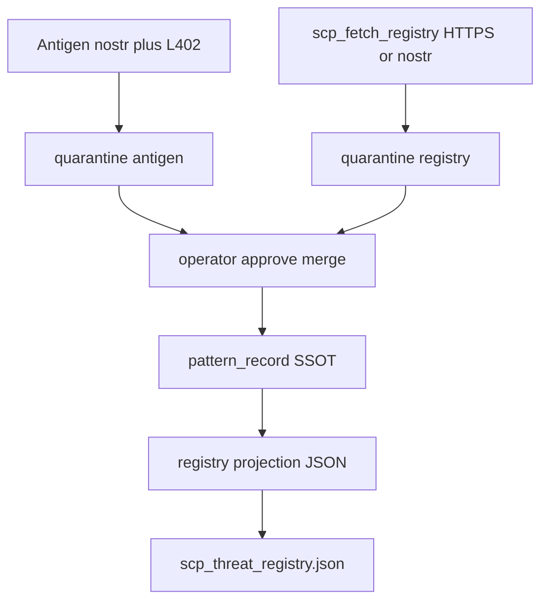

# SCP-R1 + SCP-R4 design spike — operator kickoff

**Status:** Decisions locked · spec docs written  
**Updated:** 2026-07-03  
**Handoff:** MiscRepos #173 · **Tags:** SCP `v0.1.9`

## Why now

SCP-ANT1 **transport is closed** (P0–P1b, LND regtest, P1.5 hardening pushed). Phase 2 moves from decentralized **antigen exchange** (nostr + L402) to **collective threat intelligence** (mycelium) without violating hb-1..hb-5.

| Track | Exists today | Gap |
|-------|--------------|-----|
| **Antigen (ANT1)** | `scp.pattern_bundle.v0`, nostr 30078, L402 fetch, quarantine import | Interim schema; R1 SSOT now specified |
| **Mycelium (R*)** | Local `scp_threat_registry.json` in `sanitize_input.py` | R4 fetch design; projection from SSOT |

## Spec deliverables

| Doc | Status |
|-----|--------|
| [SCP_R1_THREAT_PATTERN_SCHEMA.md](SCP_R1_THREAT_PATTERN_SCHEMA.md) | **Done** — pattern_record SSOT, Option C hybrid |
| [SCP_R4_FETCH_REGISTRY.md](SCP_R4_FETCH_REGISTRY.md) | **Done** — parallel paths, tool contract, merge tiers; runtime landed |
| [SCP_R3_CONTRIBUTE_FLOW.md](SCP_R3_CONTRIBUTE_FLOW.md) | **Implemented (spike)** — critic polish @ `2eaae53`; 24 R3 tests, 178 pytest pass |
| [SCP_R5_MCP_INTEGRATION.md](SCP_R5_MCP_INTEGRATION.md) | **Implemented** — dual-server; v1.1 read-only; inspect loop wired |
| [SCP_R2_REGISTRY_HOSTING.md](SCP_R2_REGISTRY_HOSTING.md) | **Bootstrapped** — [scp-mycelium-registry](https://github.com/ManintheCrowds/scp-mycelium-registry) @ v0.1.0 |
| [SCP_R6_PRIVACY_CONSENT.md](SCP_R6_PRIVACY_CONSENT.md) | **Spec locked** — privacy, consent, Path B gate |

**Out of scope:** production fetch allowlist hardening, mainnet L402 in contribute/fetch paths, R6 **runtime** until `proceed R6-runtime`.

## Decision forks — locked (operator 2026-07-02)

| # | Question | Your choice |
|---|----------|-------------|
| 1 | **R4 vs antigen path** | **B — Parallel** until proven |
| 2 | **R1 schema scope** | **C — Hybrid** (pattern_record SSOT + registry projection) |
| 3 | **Shared registry transport** | **Both** (nostr + HTTPS, same inner schema) |
| 4 | **Merge policy** | **Production:** operator approve always · **Dev:** optional auto-merge low-risk + low drift (`SCP_REGISTRY_MERGE_DEV_AUTO=1`) |
| 5 | **Regtest preflight** | **Mandatory** default path; auto-mine recovery + 120s poll |
| 6 | **R3 contribute track** | **Antigen reuse** (`export_bundle` + `publish_announcement`); input: `raw_content` or `patterns_json`; outbound: nostr + HTTPS |
| 7 | **R3 consent** | Two-phase; `approve=false` default; full R6 deferred |

## Architecture (fork #1 = B)

## References

- [`scp_threat_registry.json`](../src/scp/scp_threat_registry.json)
- [`antigen-bundle.v0.schema.json`](../src/scp/schemas/antigen-bundle.v0.schema.json)
- [`antigen_nostr.py`](../src/scp/antigen_nostr.py)
- MiscRepos [mycelium design](https://github.com/ManintheCrowds/MiscRepos/blob/main/docs/plans/2026-03-12-scp-saas-mycelium-design.md)

## Next step

R5 **implemented**; R6 **runtime implemented**. **Next:** operator push; live nostr v0.1.0 announce (`scripts/announce_registry_snapshot.py --publish`); paste `issuer_pubkey` into data-repo GOVERNANCE.
