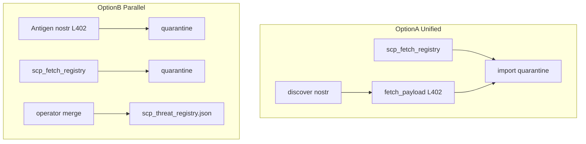

# SCP-R1 + SCP-R4 design spike — operator kickoff

**Status:** Awaiting operator feedback on decision forks below  
**Updated:** 2026-07-02  
**Handoff:** MiscRepos #170 · **Tags:** SCP `v0.1.9` @ `ae44b96`

## Why now

SCP-ANT1 **transport is closed** (P0–P1b, LND regtest, P1.5 hardening pushed). Phase 2 moves from decentralized **antigen exchange** (nostr + L402) to **collective threat intelligence** (mycelium) without violating hb-1..hb-5.

| Track | Exists today | Gap |
|-------|--------------|-----|
| **Antigen (ANT1)** | `scp.pattern_bundle.v0`, nostr 30078, L402 fetch, quarantine import | Interim schema; waits for R1 SSOT |
| **Mycelium (R*)** | Local `scp_threat_registry.json` in `sanitize_input.py` | No shared fetch/contribute; no network schema |

**R1** = semantic field SSOT both tracks converge on. **R4** = pull + merge shared patterns into local registry with offline fallback.

## Intent (approved constraints)

From [mycelium design](https://github.com/ManintheCrowds/MiscRepos/blob/main/docs/plans/2026-03-12-scp-saas-mycelium-design.md):

- Anonymized patterns only — no raw prompts, PII, or victim chat logs
- Fetch failure → local registry unchanged (recovery)
- Contribution → human gate before shared publish

From [antigen L402 design](https://github.com/ManintheCrowds/MiscRepos/blob/main/docs/superpowers/specs/2026-04-12-scp-antigen-l402-design.md) §11.2:

- Interim `scp.pattern_bundle.v0` does **not** block R1; R1 landing bumps `schema_revision` + migration
- **Payment ≠ attestation**; **no auto-merge** from fetch/discover/paid fetch

## Spec deliverables (after feedback)

| Doc | Contents |
|-----|----------|
| `SCP_R1_THREAT_PATTERN_SCHEMA.md` | Pattern record fields, anonymization rules, `v0→v1` revision plan, API sketch |
| `SCP_R4_FETCH_REGISTRY.md` | `scp_fetch_registry` contract, merge semantics, antigen path relationship |

**Out of scope:** R2 central repo, R3 contribute impl, R5 `scp_mcp.py`, production fetch allowlist, mainnet L402.

## Decision forks — operator feedback

Fill **Your choice** column (or reply in Cursor chat).

| # | Question | Options | Your choice |
|---|----------|---------|-------------|
| 1 | **R4 vs antigen path** | **A:** Unified quarantine (nostr+L402 and HTTPS fetch → same import quarantine) · **B:** Parallel paths until proven | _TBD_ |
| 2 | **R1 schema scope** | **A:** Extend `scp_threat_registry.json` buckets · **B:** Greenfield schema + migration table from `scp.pattern_bundle.v0` | _TBD_ |
| 3 | **Shared registry transport** | nostr-only · HTTPS-only · both (same schema) | _TBD_ |
| 4 | **Merge policy** | Always operator approve · auto-merge low-risk categories only | _TBD_ |
| 5 | **Regtest preflight** | Accept `-SkipPreflight` · extend sync poll · auto-mine recovery in preflight | _TBD_ |

## Architecture sketch (pending fork #1)

## References

- [`scp_threat_registry.json`](../src/scp/scp_threat_registry.json)
- [`antigen-bundle.v0.schema.json`](../src/scp/schemas/antigen-bundle.v0.schema.json)
- [`antigen_nostr.py`](../src/scp/antigen_nostr.py) — fetch/import quarantine
- MiscRepos [next-steps audit](https://github.com/ManintheCrowds/MiscRepos/blob/main/.cursor/plans/scp-ant1_next_steps_audit_5943f7b7.plan.md)

## Next step

After **Your choice** rows are filled → one session writes R1+R4 spec docs only (no implementation).
