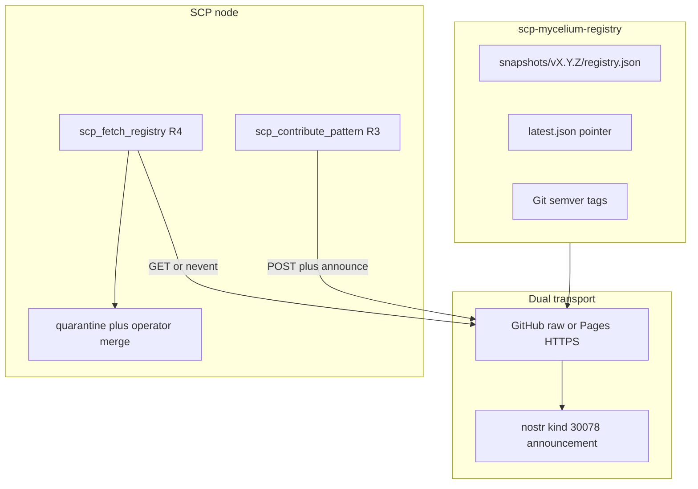

# SCP-R2 — Registry hosting (central data repo)

**decision_id:** `scp-r2-registry-hosting-2026-07-03`  
**Status:** Bootstrapped — [`scp-mycelium-registry`](https://github.com/ManintheCrowds/scp-mycelium-registry) @ `v0.1.0`  
**Depends on:** [SCP_R1_THREAT_PATTERN_SCHEMA.md](SCP_R1_THREAT_PATTERN_SCHEMA.md), [SCP_R3_CONTRIBUTE_FLOW.md](SCP_R3_CONTRIBUTE_FLOW.md), [SCP_R4_FETCH_REGISTRY.md](SCP_R4_FETCH_REGISTRY.md)

## Purpose

Define the **central data-only repository** that hosts canonical `scp.registry_snapshot.v1` aggregates for the mycelium shared threat registry (Approach B).

| Concern | Repo |
|---------|------|
| Tooling (MCP, validate, fetch, contribute) | [`ManintheCrowds/SCP`](https://github.com/ManintheCrowds/SCP) |
| **Registry data** (snapshots, governance) | **`ManintheCrowds/scp-mycelium-registry`** (this spec) |

Nodes **publish** via R3 [`scp_contribute_pattern`](../src/scp/antigen_mcp.py) and **pull** via R4 [`scp_fetch_registry`](../src/scp/antigen_mcp.py). This spec defines layout, transport URLs, etag discipline, license, and governance — not SCP runtime code.

---

## Operator locks (2026-07-03)

| Decision | Choice |
|----------|--------|
| Hosting model | **Path A** — separate data repo |
| Repo name | `scp-mycelium-registry` |
| License | **MIT** on all registry content (same text as SCP) |
| Transport | **Both** HTTPS + nostr (symmetric with R3/R4) |
| Content address | `snapshot.etag` = canonical hash of `patterns[]` |

---

## Architecture



**HTTPS is authoritative.** Nostr kind 30078 announcements are a **discovery** layer; `payload_urls[0]` MUST be an HTTPS URL whose GET body is the full `scp.registry_snapshot.v1` JSON.

---

## Repository layout (normative)

Bootstrap from templates in [`registry-repo-templates/`](registry-repo-templates/).

```
scp-mycelium-registry/
├── LICENSE                 # MIT (copy from SCP)
├── README.md
├── CONTRIBUTING.md
├── GOVERNANCE.md
├── latest.json             # pointer only — not a full snapshot duplicate
└── snapshots/
    └── v0.1.0/
        └── registry.json   # scp.registry_snapshot.v1 envelope
```

### `latest.json` pointer

Small index file on `main` (updated when a new semver is released):

```json
{
  "schema_revision": "scp.registry_pointer.v1",
  "version": "0.1.0",
  "registry_url": "https://raw.githubusercontent.com/ManintheCrowds/scp-mycelium-registry/v0.1.0/snapshots/v0.1.0/registry.json",
  "etag": "sha256:…",
  "published_at": "2026-07-03T00:00:00Z"
}
```

| Field | Rule |
|-------|------|
| `registry_url` | HTTPS URL to immutable tag-scoped snapshot |
| `etag` | MUST equal `registry.json` → `etag` field |
| `version` | Semver matching git tag `vX.Y.Z` |

### Versioning

| Mechanism | Format | Mutability |
|-----------|--------|------------|
| Git tag | `v0.1.0` | **Immutable** — never force-push or rewrite tagged commits |
| Snapshot dir | `snapshots/v0.1.0/registry.json` | Frozen at tag |
| `registry_version` (inside snapshot) | ISO8601 UTC (e.g. `2026-07-03T12:00:00Z`) | Set at publish time; matches R3 [`_build_snapshot`](../src/scp/registry_contribute.py) |
| Semver bump | patch = pattern add/fix; minor = taxonomy/category change; major = breaking schema | Per [CONTRIBUTING.md](registry-repo-templates/CONTRIBUTING.md) |

### Canonical HTTPS URLs

| Channel | URL pattern |
|---------|-------------|
| **GitHub raw (primary)** | `https://raw.githubusercontent.com/ManintheCrowds/scp-mycelium-registry/v{semver}/snapshots/v{semver}/registry.json` |
| **GitHub Pages (optional)** | `https://maninthecrowds.github.io/scp-mycelium-registry/snapshots/v{semver}/registry.json` |
| **Latest pointer** | `https://raw.githubusercontent.com/ManintheCrowds/scp-mycelium-registry/main/latest.json` |

Tag-scoped raw URLs are **immutable**. Only `main` branch `latest.json` may advance to point at a newer tag.

---

## Snapshot envelope (wire format)

Reuse R1 — no new schema revision.

| Field | Value / rule |
|-------|----------------|
| `schema_revision` | `"scp.registry_snapshot.v1"` ([`REGISTRY_SNAPSHOT_REVISION`](../src/scp/pattern_record.py)) |
| `registry_version` | ISO8601 UTC publish timestamp |
| `etag` | Content address of `patterns[]` (see below) |
| `patterns` | Non-empty `pattern_record[]` — R1 deny-list; no PII or raw prompts |

Example:

```json
{
  "schema_revision": "scp.registry_snapshot.v1",
  "registry_version": "2026-07-03T12:00:00Z",
  "etag": "sha256:abc…",
  "patterns": [
    {
      "pattern_id": "contrib.inj.abc12345",
      "category": "injection",
      "detector": { "kind": "token_family", "normalized": "injection-family-abc12345" },
      "risk_tier": "medium",
      "registry_bucket": "power_words"
    }
  ]
}
```

### Validation gate

Pre-merge CI and R4 fetch both require:

1. [`validate_snapshot`](../src/scp/pattern_record.py) — envelope shape
2. [`validate_snapshot_patterns`](../src/scp/pattern_record.py) — each record + anonymization deny-list

Fail closed on any reject.

---

## Etag discipline (normative)

**Authoritative content address:** `snapshot.etag`

Computed identically to R3 [`_canonical_patterns_hash`](../src/scp/registry_contribute.py):

```python
canonical = json.dumps(patterns, sort_keys=True, separators=(",", ":"), ensure_ascii=False)
etag = "sha256:" + sha256(canonical.encode("utf-8")).hexdigest()
```

Where `patterns` is the **array value only** (not the full snapshot object).

### Checklist (every release)

1. Compute etag from final `patterns[]`; embed in `registry.json`
2. Set HTTP `ETag` response header on POST targets to the same value (R3 [`post_registry_snapshot`](../src/scp/registry_contribute.py) normalizes to `sha256:` prefix)
3. Copy etag into `latest.json`
4. Git tag `vX.Y.Z` at the commit containing the snapshot

### Nostr vs snapshot etag

| Hash | Scope | Used for |
|------|-------|----------|
| `snapshot.etag` | Canonical JSON of `patterns[]` (full `pattern_record` fields) | HTTPS snapshot, `latest.json`, R4 conditional fetch |
| `manifest.payload_content_hash` | Canonical JSON of antigen bundle `payload` object (`{patterns: bundle_shape[]}`) | Nostr kind 30078 signature / `x` tag |

These **differ** when R3 maps records via [`_to_bundle_patterns`](../src/scp/registry_contribute.py) (subset of fields). For R2 hosting:

- **Verify registry integrity** using `snapshot.etag` after HTTPS GET
- **Verify nostr announcement** using `payload_content_hash` over the bundle payload
- **Cross-link:** `payload_urls[0]` MUST resolve to bytes whose parsed `etag` matches the announced snapshot version

---

## Publish workflow

### Path A — Git PR (v0 default)

| Step | Actor | Action |
|------|-------|--------|
| 1 | Maintainer | Branch; add/edit `snapshots/vX.Y.Z/registry.json` |
| 2 | CI | Run `validate_snapshot` + `validate_snapshot_patterns` |
| 3 | Review | Maintainer checks deny-list, semver bump, etag recompute |
| 4 | Merge | Merge to `main` |
| 5 | Tag | `git tag vX.Y.Z` (immutable) |
| 6 | Pointer | Update `latest.json` on `main` |
| 7 | Nostr (optional) | Operator publishes kind 30078 with `payload_urls[0]` = tag-scoped raw URL |

### Path B — R3 tool (gated)

Operator calls `scp_contribute_pattern` with `transport=both`, `https_url` = registry POST endpoint or future upload seam, `approve=true`.

**v0 lock:** Path A only until [GOVERNANCE.md](registry-repo-templates/GOVERNANCE.md) §Community contributions opens Path B for non-maintainers.

---

## Fetch workflow (R4 alignment)

Nodes pull with [`scp_fetch_registry`](../src/scp/registry_fetch.py):

| Param | Example |
|-------|---------|
| `source` | Tag-scoped raw URL **or** `latest.json` URL **or** nostr `nevent1…` / hex id |
| `allowlist` | Host + optional issuer pubkey (fail closed) |
| `if_none_match` | Prior `etag` for conditional GET |

### Default allowlist (document in node config)

```json
{
  "hosts": ["raw.githubusercontent.com", "maninthecrowds.github.io"],
  "issuer_pubkeys": ["<maintainer-nostr-hex-pubkey>"]
}
```

Fetch success → quarantine file → operator [`scp_apply_registry_quarantine`](../src/scp/antigen_mcp.py) (never auto-merge).

### Example fetch sources

```
https://raw.githubusercontent.com/ManintheCrowds/scp-mycelium-registry/v0.1.0/snapshots/v0.1.0/registry.json
https://raw.githubusercontent.com/ManintheCrowds/scp-mycelium-registry/main/latest.json
```

---

## License — MIT

The entire data repo is **MIT licensed** ([LICENSE](../LICENSE) text reused).

- Anonymized `pattern_record` entries are contributions under MIT (not CC0).
- Single-license repo simplifies compliance for downstream SCP nodes and eval harnesses.
- PR authors confirm MIT grant in [CONTRIBUTING.md](registry-repo-templates/CONTRIBUTING.md).

---

## Bootstrap plan (executed)

**Released:** `v0.1.0` — export via [`scripts/export_mycelium_snapshot.py`](../scripts/export_mycelium_snapshot.py)

1. ~~Create GitHub repo~~ → [ManintheCrowds/scp-mycelium-registry](https://github.com/ManintheCrowds/scp-mycelium-registry)
2. ~~Export packaged registry~~ → `records_from_legacy_registry` + `build_registry_snapshot`
3. ~~Tag `v0.1.0`~~ → immutable snapshot at tag-scoped raw URL
4. Optional: nostr announcement with maintainer pubkey on allowlist

---

## Relationship to other tracks

| Track | Role |
|-------|------|
| **R1** | `pattern_record` SSOT — inner schema for snapshots |
| **R3** | Outbound publish to HTTPS + nostr |
| **R4** | Inbound fetch + quarantine |
| **R5** | Inspect loop reads projection after merge — needs fetch target (this repo) |
| **R6** | Full privacy/consent spec — prerequisite for community Path B writes |

---

## Security invariants

- Fail closed: invalid snapshot rejected at CI and at R4 fetch
- Allowlist required on fetch (host + optional pubkey)
- No secrets, PII, or raw reproducible attack strings in registry JSON (R1 deny-list)
- Immutable semver tags — never mutate tagged snapshot paths
- Nostr `payload_urls` MUST be HTTPS ([`antigen_nostr.py`](../src/scp/antigen_nostr.py))
- Fetch failure → local registry unchanged (R4 recovery pattern)
- Payment ≠ attestation; publish/fetch success ≠ local SSOT merge

---

## Out of scope

- GitHub repo creation, Actions CI YAML, Pages enablement (bootstrap slice)
- Community write access before R6 privacy spec
- Mainnet L402 paid registry tier
- Auto-merge on fetch (unchanged R4 policy)
- REST API beyond static JSON files
- SCP Python code changes (this slice is docs + templates only)

---

## References

- [SCP_R1_THREAT_PATTERN_SCHEMA.md](SCP_R1_THREAT_PATTERN_SCHEMA.md)
- [SCP_R3_CONTRIBUTE_FLOW.md](SCP_R3_CONTRIBUTE_FLOW.md)
- [SCP_R4_FETCH_REGISTRY.md](SCP_R4_FETCH_REGISTRY.md)
- [SCP_R5_MCP_INTEGRATION.md](SCP_R5_MCP_INTEGRATION.md)
- [registry-repo-templates/](registry-repo-templates/) — bootstrap files
- MiscRepos [mycelium design §Approach B](https://github.com/ManintheCrowds/MiscRepos/blob/main/docs/plans/2026-03-12-scp-saas-mycelium-design.md)
