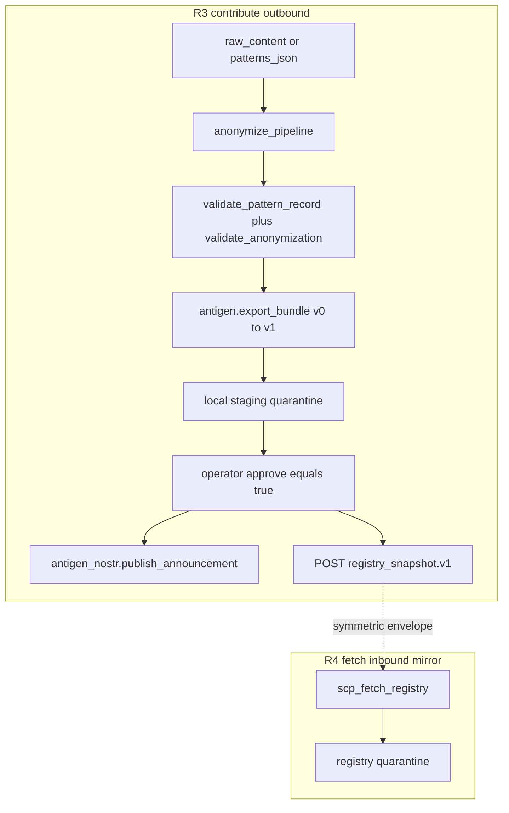
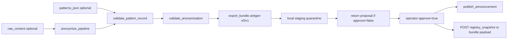

# SCP-R3 — Contribute pattern flow

**decision_id:** `scp-r3-contribute-flow-2026-07-03`  
**Status:** Implemented (spike) — [`registry_contribute.py`](../src/scp/registry_contribute.py), MCP `scp_contribute_pattern`, CLI `contribute`  
**Depends on:** [SCP_R1_THREAT_PATTERN_SCHEMA.md](SCP_R1_THREAT_PATTERN_SCHEMA.md), [SCP_R4_FETCH_REGISTRY.md](SCP_R4_FETCH_REGISTRY.md)

## Purpose

Define how a node **prepares**, **stages**, and (after operator approval) **publishes** anonymized threat patterns to the network — the symmetric **outbound** path to R4 fetch.

Unlike R4 (parallel antigen vs registry fetch, fork #1 = B), R3 **reuses the antigen track** (`export_bundle` + `publish_announcement`) with extra human gates. It is not a greenfield parallel module.

**Not in scope:** wiring into [`scp_mcp.py`](../src/scp/scp_mcp.py) (SCP-R5 / OpenHarness contract review).

## Seam design (frontier-ops)

Per [mycelium design §Collective Learning](https://github.com/ManintheCrowds/MiscRepos/blob/main/docs/plans/2026-03-12-scp-saas-mycelium-design.md) and frontier-ops seam design: agents may prepare, anonymize, and validate; **only the operator** approves outbound submit.

| Phase | Actor | Action |
|-------|-------|--------|
| Prepare | Agent | classify / anonymize / validate / stage to local quarantine |
| Propose | Agent | return proposal JSON (`approve=false`, zero network I/O) |
| Review | Operator | inspect `proposal.pattern_ids`, `bundle_preview_hash`, `anonymization_warnings` |
| Publish | Operator | re-call with `approve=true` → nostr and/or HTTPS |
| Recovery | System | publish failure → staged quarantine unchanged; no partial network state |

### Audit contract

- Reject → audit event `pattern_rejected_anonymization` via [`antigen._audit`](../src/scp/antigen.py)
- **Hash-only on reject** — never log `raw_content`, reproducible attack strings, PII, or credential material
- Accept/stage → audit ids + counts only (same contract as R4 fetch)

## Architecture — antigen reuse (not parallel)

R4 fetch stayed **parallel** to antigen until proven. R3 contribute **embeds in antigen** with a thin orchestrator and extra publish gate.



### Reuse vs parallel (explicit contrast)

| Aspect | R4 fetch (inbound) | R3 contribute (outbound) |
|--------|-------------------|-------------------------|
| Module strategy | Parallel `registry_fetch.py` | **Antigen reuse** + thin contribute orchestrator |
| Envelope on wire | `scp.registry_snapshot.v1` | Nostr: antigen bundle; HTTPS: `registry_snapshot.v1` |
| Auto-merge / auto-publish | Never | Never |
| Human gate | merge step (`approve` on apply) | **publish step** (`approve` on contribute) |
| Inner records | `pattern_record` | `pattern_record` (same SSOT) |

## Tool contract: `scp_contribute_pattern`

Surface: [`antigen_mcp.py`](../src/scp/antigen_mcp.py) (same MCP server as R4 fetch tools).

Returns JSON string (same convention as `scp_fetch_registry`, `scp_antigen_publish`).

### Inputs

| Param | Type | Required | Description |
|-------|------|----------|-------------|
| `patterns_json` | string | one of | JSON list of `pattern_record` OR `{patterns:[]}` |
| `raw_content` | string | one of | Flagged text to run through anonymization pipeline |
| `category` | string | if raw | Taxonomy hint: `injection`, `jailbreak`, etc. |
| `risk_tier` | enum | if raw | `low` \| `medium` \| `high` \| `critical`; default `medium` if omitted |
| `transport` | enum | yes | `nostr` \| `https` \| `both` |
| `https_url` | string | if https/both | POST target (operator-supplied) |
| `relays` | string | no | Comma-separated WSS URLs |
| `approve` | bool | no | Default **false** — proposal only |
| `dry_run` | bool | no | Default true when `approve=false`; force no network I/O |
| `seckey_hex` | string | no | Nostr signing key (or env `NOSTR_SECKEY`) |

**Normative input rules:**

- Exactly one of `patterns_json` or `raw_content` required (mutually exclusive)
- When `raw_content` is supplied, `category` is required
- When `approve=false`, **zero network I/O** (including relay connect); `dry_run` defaults to `true`
- When `transport` is `https` or `both`, `https_url` is required

### Outputs (proposal — `approve=false`)

```json
{
  "ok": true,
  "submitted": false,
  "proposal": {
    "pattern_count": 1,
    "pattern_ids": ["contrib.inj.hash8"],
    "anonymization_warnings": [],
    "bundle_preview_hash": "sha256:…",
    "quarantine_path": "…"
  }
}
```

### Outputs (submitted — `approve=true`)

```json
{
  "ok": true,
  "submitted": true,
  "nostr": { "event_id": "…", "relays": [] },
  "https": { "status": 201, "etag": "sha256:…" },
  "bundle_hash": "sha256:…"
}
```

When `transport` is `nostr` only, `https` is omitted. When `transport` is `https` only, `nostr` is omitted.

### Outputs (rejected)

```json
{
  "ok": false,
  "error": "anonymization_failed",
  "reasons": ["pii_email_detected"],
  "submitted": false
}
```

### Outputs (publish failure — recovery)

```json
{
  "ok": false,
  "error": "publish_failed",
  "submitted": false,
  "local_staging_preserved": true
}
```

Network/TLS/relay/signing failure after staging → local quarantine file **unchanged** (mycelium Recovery pattern).

### Outputs (partial publish — `transport=both` only)

When HTTPS POST succeeds (2xx) but live nostr publish fails, return an explicit partial state (not generic `publish_failed`):

```json
{
  "ok": false,
  "error": "partial_publish",
  "submitted": false,
  "partial_publish": true,
  "https": { "status": 201, "etag": "sha256:…" },
  "nostr_failure_reason": "publish_failed",
  "nostr_failure_detail": "relay unreachable",
  "local_staging_preserved": true,
  "quarantine_path": "…"
}
```

(`nostr_failure_detail` omitted when empty.)

Operator uses `https.etag` / status for manual remote reconciliation or takedown. Atomic HTTPS rollback is out of scope (no registry DELETE API in this spike).

### Preflight (`transport=both`)

Before any HTTPS I/O when `transport=both`:

1. Resolve `seckey_hex` / `NOSTR_SECKEY` — fail with `seckey_required` without POST
2. Nostr `publish_announcement(..., dry_run=True)` — fail fast on signing/build errors; returns `publish_failed` without HTTPS POST

Live publish order remains **HTTPS POST → nostr live** (payload URL must be live before announcement).

## Pipeline (normative)



### Steps

1. **Input resolution** — parse `patterns_json` as list or `{patterns:[]}` wrapper (same as `scp_antigen_export`)
2. **Raw path** — if `raw_content`: run anonymization pipeline (below) → emit `pattern_record[]`
3. **Validate** — [`validate_pattern_record`](../src/scp/pattern_record.py) + [`validate_anonymization`](../src/scp/pattern_record.py) + **contribute abstraction gate** per record (`patterns_json` must match raw-path shape: `pattern_id=contrib.{abbrev}.{hash8}`, `detector.kind=token_family`, `detector.normalized={category}-family-{hash8}`); fail closed on any reject
4. **Bundle** — [`export_bundle`](../src/scp/antigen.py) with `bundle_version` migration v0→v1 (inner records conform to R1 SSOT)
5. **Verify** — [`verify_bundle`](../src/scp/antigen.py) before staging
6. **Stage** — write to local contribute quarantine (reuse quarantine primitive; **no SSOT merge** unless operator opts in via separate R4 merge tool)
7. **Proposal** — if `approve=false`, return proposal JSON; emit audit with hash-only fields
8. **Publish** — if `approve=true`:
   - **`transport=both` preflight:** seckey check + nostr dry-run before HTTPS POST (see Preflight above)
   - **nostr:** [`publish_announcement`](../src/scp/antigen_nostr.py) (requires `seckey_hex` or `NOSTR_SECKEY`)
   - **https:** `post_registry_snapshot` helper (spec-only; see HTTPS outbound)

Reject policy: **fail closed**; no silent partial success. When `transport=both` and HTTPS succeeds but nostr fails, return explicit `partial_publish` (see above).

## Anonymization pipeline (outbound)

Stages for `raw_content` → `pattern_record`:

| Stage | Anchor | Behavior |
|-------|--------|----------|
| **Classify** | [`sanitize_input.classify`](../src/scp/sanitize_input.py) | Tier + categories; `category` param overrides taxonomy hint when supplied |
| **Strip** | R1 deny-list ([§Anonymization](SCP_R1_THREAT_PATTERN_SCHEMA.md)) | Reject PII, prohibited keys, credential URLs **before** abstract |
| **Abstract** | New (implementation) | Emit `detector.kind=token_family` with masked `normalized` — **not** literal attack text; derive `pattern_id` as `contrib.<category>.<hash8>` |
| **Validate** | `validate_pattern_record` + `validate_anonymization` | Fail closed; no partial publish |

### R1 deny-list (hard)

Must **never** appear in outbound `pattern_record`:

- Raw victim prompts, chat logs, or session transcripts
- PII (names, emails, phone, addresses)
- URLs with credentials or session tokens
- Reproducible cognitohazard bodies (full hazardous text)
- Executable code intended as payload (only defensive signatures)

Violations → `{ok: false, error: "anonymization_failed", …}` + audit `pattern_rejected_anonymization` (ids/counts only).

### Fork: rule-only vs optional LLM normalize

| Approach | Pros | Cons |
|----------|------|------|
| **Rule-only (default)** | Deterministic, auditable, no model leakage risk | Weaker on novel obfuscation |
| **LLM normalize (env-gated, e.g. `SCP_CONTRIBUTE_LLM_NORMALIZE=1`)** | Better abstraction on edge cases | Non-deterministic; needs human gate + extra audit; model may regurgitate raw |

**Recommendation:** rule-only default; LLM path deferred to R6 with explicit operator opt-in.

## Antigen reuse mapping

| Step | Reuse | Notes |
|------|-------|-------|
| Bundle build | `antigen.export_bundle` | Inner records conform to `pattern_record`; migrate v0→v1 path |
| Verify | `antigen.verify_bundle` | Before staging |
| Stage | quarantine write | Staging only; no merge to local SSOT unless operator opts in via R4 merge |
| Nostr | `antigen_nostr.publish_announcement` | Only after `approve=true`; mirrors `scp_antigen_publish` |
| HTTPS | `post_registry_snapshot` (new, spec) | POST `scp.registry_snapshot.v1`; see below |

**Not reused for contribute:** `import_bundle` merge path, L402 `fetch_payload`, mainnet micropayment flows.

## HTTPS outbound (design)

### Method and body

- **Method:** POST
- **Content-Type:** `application/json`
- **Body:** [`scp.registry_snapshot.v1`](../src/scp/schemas/registry-snapshot.v1.schema.json) with one or more patterns

```json
{
  "schema_revision": "scp.registry_snapshot.v1",
  "registry_version": "2026-07-03T00:00:00Z",
  "etag": "sha256:…",
  "patterns": [ { "pattern_id": "contrib.inj.hash8", "category": "injection", "detector": { "kind": "token_family", "normalized": "…" }, "risk_tier": "medium" } ]
}
```

Symmetric with R4 fetch pull — same inner schema (fork #3 = both).

### Envelope choice (documented)

| Option | Role | Contribute path |
|--------|------|-----------------|
| **`registry_snapshot.v1` POST** | Direct HTTPS contribute | **Recommended default** for `transport=https` or `both` |
| Antigen hosted payload URL + nostr announcement | Discovery + L402 fetch | **Not used** in contribute path (L402-adjacent; no mainnet L402) |

Nostr transport uses antigen bundle + `publish_announcement` (kind 30078); HTTPS transport uses snapshot POST for registry symmetry.

### Auth

None in this spike. Future seam: mTLS or API key (operator-configured; out of scope here).

### Regtest guard

When `SCP_ANTIGEN_REGTEST_E2E=1`, apply [`assert_localhost_fetch_url`](../src/scp/antigen_l402.py) to `https_url` POST target (reuse P1.5 localhost guard).

### Failure

```json
{
  "ok": false,
  "error": "https_post_failed",
  "submitted": false,
  "local_staging_preserved": true
}
```

## Consent and R6 pointer

### Two-phase consent (this spike)

| Phase | Gate | Behavior |
|-------|------|----------|
| **Proposal (default)** | `approve=false` | Stage locally; return proposal; zero network I/O |
| **Publish** | `approve=true` | Operator explicit; nostr and/or HTTPS submit |

Production default: **no dev auto-submit**. There is no env gate that bypasses `approve=true` for network publish (unlike R4 dev auto-merge, which applies only to inbound merge).

### R6 privacy and consent (spec locked)

See [SCP_R6_PRIVACY_CONSENT.md](SCP_R6_PRIVACY_CONSENT.md) for anonymization guarantees, attestation (`SCP_CONTRIBUTE_CONSENT=1` at runtime), opt-in log, retention/takedown, and Path B gates.

Cross-ref: mycelium design §Collective Learning; frontier-ops human gate for shared registry writes.

## Security invariants

Must match R4 + antigen invariants:

| Invariant | Contribute application |
|-----------|------------------------|
| **hb-1** | No auto-spend; no auto-publish; operator `approve=true` required |
| **hb-2** | Fail closed on anonymization reject; empty signing key → nostr publish fails |
| **hb-3** | `https_url` and relays are operator-supplied; no trust of agent-provided URLs without review |
| **hb-4** | Regtest E2E = one operator gate (`SCP_ANTIGEN_REGTEST_E2E=1`) |
| **hb-5** | Regtest ≠ mainnet; mainnet L402 **not** in contribute path |
| Payment ≠ attestation | Publish success ≠ local SSOT merge |
| `approve=false` | Zero network I/O (except dry_run introspection metadata) |
| Rejected anonymization | Audit `pattern_rejected_anonymization` — ids/counts only |
| Wire format | No PII/raw prompts (R1 deny-list) |

## Out of scope

- R2 **bootstrap** (GitHub repo creation, first snapshot publish) — spec locked; gate `proceed R2-bootstrap`
- R5 `scp_mcp.py` wiring
- R6 full privacy and consent spec — **[SCP_R6_PRIVACY_CONSENT.md](SCP_R6_PRIVACY_CONSENT.md)** (runtime gated `proceed R6-runtime`)
- SSOT auto-merge on contribute (operator uses `scp_apply_registry_quarantine` separately if desired)
- Mainnet L402 in contribute path

## References

- [SCP_R1_THREAT_PATTERN_SCHEMA.md](SCP_R1_THREAT_PATTERN_SCHEMA.md)
- [SCP_R4_FETCH_REGISTRY.md](SCP_R4_FETCH_REGISTRY.md)
- [SCP_R2_REGISTRY_HOSTING.md](SCP_R2_REGISTRY_HOSTING.md)
- [SCP_R1_R4_SPIKE_KICKOFF.md](SCP_R1_R4_SPIKE_KICKOFF.md)
- [ANTIGEN_P1_NOSTR.md](ANTIGEN_P1_NOSTR.md)
- MiscRepos [mycelium design §Collective Learning](https://github.com/ManintheCrowds/MiscRepos/blob/main/docs/plans/2026-03-12-scp-saas-mycelium-design.md)
- MiscRepos [frontier-ops seam design](https://github.com/ManintheCrowds/MiscRepos/blob/main/frontier-ops-kb/operations/seam-design.md)
