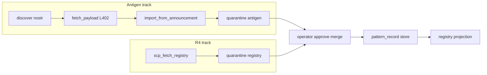

# SCP-R4 — Fetch registry flow

**decision_id:** `scp-r4-fetch-registry-2026-07-02`  
**Status:** Implemented (spike) — `registry_fetch.py`, `registry_ssot.py`, `pattern_record.py`; MCP tools in `antigen_mcp.py`  
**Depends on:** [SCP_R1_THREAT_PATTERN_SCHEMA.md](SCP_R1_THREAT_PATTERN_SCHEMA.md)

## Purpose

Define how a node **pulls** anonymized threat patterns from the network, **quarantines** them, and (after operator approval) **merges** into local SSOT + registry projection — with **offline fallback** when fetch fails.

## Architecture — parallel paths (fork #1 = B)

Antigen and registry fetch stay **separate code paths** until proven stable.



Shared concept: **quarantine** + **no auto-merge**. Distinct modules: [`antigen_nostr.py`](../src/scp/antigen_nostr.py) vs future `registry_fetch.py`.

**Not in scope:** wiring into [`scp_mcp.py`](../src/scp/scp_mcp.py) (SCP-R5 / OpenHarness contract review).

## Tool contract: `scp_fetch_registry`

Surface: [`antigen_mcp.py`](../src/scp/antigen_mcp.py) (design only for this spike).

### Inputs

| Param | Type | Required | Description |
|-------|------|----------|-------------|
| `source` | string | yes | HTTPS URL **or** nostr event reference (`nevent1…` / hex id) |
| `allowlist` | string[] | yes | Issuer/host allowlist (fail closed) |
| `if_none_match` | string | no | Etag from prior fetch |
| `tls_verify` | bool | no | Default true; regtest may set false via env seam |

Environment seams (regtest/integration only):

- `SCP_ANTIGEN_REGTEST_E2E=1` — localhost fetch guard (P1.5)
- Not used for merge auto-apply

### Outputs (success)

```json
{
  "ok": true,
  "quarantine_path": "/path/to/quarantine/registry-<id>.json",
  "registry_version": "2026-07-02T00:00:00Z",
  "etag": "sha256:…",
  "diff_summary": {
    "add_count": 3,
    "conflict_count": 0,
    "drift_max": 0.12,
    "risk_breakdown": { "low": 2, "medium": 1 }
  },
  "merged": false
}
```

`merged` is **always false** on fetch — merge is a separate operator-gated step.

### Outputs (failure — recovery)

```json
{
  "ok": false,
  "error": "fetch_failed",
  "local_registry_unchanged": true
}
```

Network/TLS/allowlist/hash mismatch → local `scp_threat_registry.json` **unchanged** (mycelium Recovery pattern).

### Example sources (R2 central repo)

When [SCP_R2_REGISTRY_HOSTING.md](SCP_R2_REGISTRY_HOSTING.md) is bootstrapped:

```
https://raw.githubusercontent.com/ManintheCrowds/scp-mycelium-registry/v0.1.0/snapshots/v0.1.0/registry.json
https://raw.githubusercontent.com/ManintheCrowds/scp-mycelium-registry/main/latest.json
```

## Fetch algorithm (normative sketch)

1. Resolve `source` to HTTPS GET or nostr payload retrieval
2. Verify allowlist (host + optional issuer pubkey on signed snapshots)
3. Parse body as `scp.registry_snapshot.v1` (see R1)
4. Validate each entry with `pattern_record` rules + anonymization deny-list
5. Write quarantine file; compute diff vs local SSOT (not projection file directly)
6. Emit audit: `registry_fetch_quarantine` (no secrets, no full patterns in log — ids + counts only)

## Merge semantics

Separate tool/step: `scp_apply_registry_quarantine` (future).

| Step | Actor | Action |
|------|-------|--------|
| 1 | Agent | `scp_fetch_registry` → quarantine |
| 2 | Operator | Review diff_summary + quarantine file |
| 3 | Operator | Approve merge (CLI/MCP explicit call) |
| 4 | System | Append to SSOT; recompile registry projection; bump `version` |

### Conflict policy

- Same `pattern_id`, identical detector → no-op
- Same `pattern_id`, different detector → **conflict**; requires operator choice (keep local / take remote / skip)
- New `pattern_id` → candidate add

### Merge policy tiers (fork #4)

| Mode | Gate | Behavior |
|------|------|----------|
| **production (default)** | none | All candidates require operator approve |
| **dev auto-low-risk** | `SCP_REGISTRY_MERGE_DEV_AUTO=1` | Auto-apply adds where `risk_tier=low` AND `drift_score` ≤ `SCP_REGISTRY_MAX_DRIFT` (default 0.15) AND category in `SCP_REGISTRY_DEV_AUTO_CATEGORIES` |

Dev auto-merge **never** applies to antigen L402 import path without the same env gates.

Audit events: `merge_operator_approved`, `merge_auto_applied` (dev only).

## Transport (fork #3 = both)

| Transport | Envelope | Notes |
|-----------|----------|-------|
| HTTPS | `scp.registry_snapshot.v1` JSON | Etag caching; content-hash optional second check |
| Nostr | Kind 30078 or dedicated registry event | Same inner `patterns[]`; signature + allowlist pubkey |

## Relationship to antigen

| Aspect | Antigen | R4 fetch |
|--------|---------|----------|
| Discovery | nostr discover | URL or nostr ref param |
| Payment | L402 optional | Typically free tier or separate gate |
| Quarantine dir | antigen quarantine | registry quarantine |
| Merge | `import_from_announcement` (no merge default) | `scp_apply_registry_quarantine` |
| Schema | `scp.pattern_bundle.v1` | `scp.registry_snapshot.v1` |
| Inner records | `pattern_record` | `pattern_record` (same SSOT) |

## Security invariants

- hb-1: no auto-spend; L402 token operator-supplied
- hb-2: allowlist fail-closed
- Payment ≠ attestation; fetch_ok ≠ merge
- Fetch failure → local registry unchanged
- No PII/raw prompts in wire format (R1 deny-list)

## References

- [SCP_R3_CONTRIBUTE_FLOW.md](SCP_R3_CONTRIBUTE_FLOW.md)
- [SCP_R1_THREAT_PATTERN_SCHEMA.md](SCP_R1_THREAT_PATTERN_SCHEMA.md)
- [SCP_R2_REGISTRY_HOSTING.md](SCP_R2_REGISTRY_HOSTING.md)
- [SCP_R1_R4_SPIKE_KICKOFF.md](SCP_R1_R4_SPIKE_KICKOFF.md)
- MiscRepos [mycelium design §Recovery](https://github.com/ManintheCrowds/MiscRepos/blob/main/docs/plans/2026-03-12-scp-saas-mycelium-design.md)
