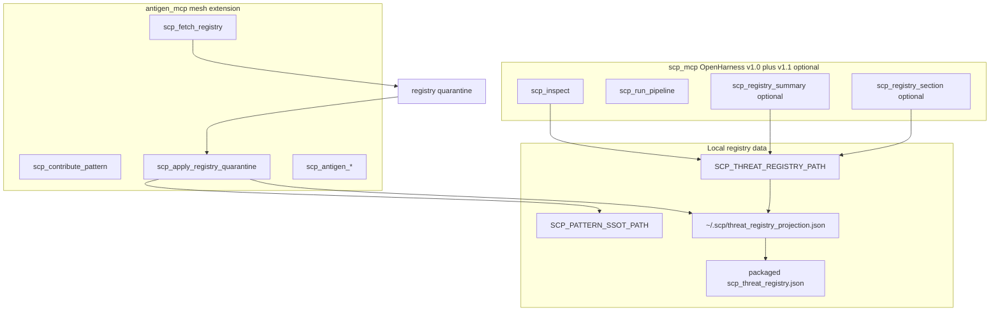

# SCP-R5 — MCP integration (dual-server)

**decision_id:** `scp-r5-mcp-integration-2026-07-03`  
**Status:** Spec locked (spike) — no runtime until operator `proceed R5`  
**Depends on:** [SCP_R1_THREAT_PATTERN_SCHEMA.md](SCP_R1_THREAT_PATTERN_SCHEMA.md), [SCP_R4_FETCH_REGISTRY.md](SCP_R4_FETCH_REGISTRY.md), [SCP_R3_CONTRIBUTE_FLOW.md](SCP_R3_CONTRIBUTE_FLOW.md)

## Purpose

Define how **OpenHarness core MCP** (`scp_mcp.py`) and **mesh extension MCP** (`antigen_mcp.py`) work together so nodes can **pull shared threat patterns** and **inspect with updated local registry** — without breaking the frozen v1.0 contract or duplicating network tools on core.

**Operator lock (2026-07-03):** **Dual-server** — v1.0 core frozen; mesh on `antigen_mcp`; optional v1.1 read-only registry tools on core.

---

## Dual-server topology



| Server | Module | Contract doc | Role |
|--------|--------|--------------|------|
| **Core** | [`scp_mcp.py`](../src/scp/scp_mcp.py) | OpenHarness `scp_mcp_v1.md` (required) + `scp_mcp_v1.1.md` (optional) | Trust-boundary primitives; read-only registry introspection |
| **Mesh** | [`antigen_mcp.py`](../src/scp/antigen_mcp.py) | `scp_antigen_mcp_v1.md` (new, OpenHarness) | Fetch, contribute, apply, antigen transport |

**Not in scope for core:** `scp_fetch_registry`, `scp_contribute_pattern`, `scp_apply_registry_quarantine`, nostr/HTTPS publish — remain on `antigen_mcp` only (R3/R4 explicit deferral preserved).

---

## Contract split

### v1.0 required (unchanged)

Nine tools enforced by [`test_mcp_contract_v1.py`](../tests/test_mcp_contract_v1.py) exact match:

`scp_inspect`, `scp_sanitize`, `scp_contain`, `scp_quarantine`, `scp_list_quarantine`, `scp_purge_quarantine`, `scp_validate_output`, `scp_mask_secrets`, `scp_run_pipeline`

SHA pinned via [`test_contract_document_hash.py`](../tests/test_contract_document_hash.py) ↔ [OpenHarness `scp_mcp_v1.md`](../../OpenHarness/docs/contracts/scp_mcp_v1.md).

### v1.1 optional (core add-ons — read-only)

Port from harness reference [`local-proto/scripts/scp_mcp.py`](../../MiscRepos/local-proto/scripts/scp_mcp.py):

| Tool | Parameters | Success return | Notes |
|------|------------|----------------|-------|
| `scp_registry_summary` | none | JSON `{registry_path, sections: {name: count}}` or error | Path redacted unless debug meta env |
| `scp_registry_section` | `section: string`, `max_chars?: int` | JSON `{section, excerpt, truncated}` | Allowlisted section names; hard cap 4096 chars |

v1.1 tools are **optional** for consumers; v1.0-only hosts remain conformant.

### Antigen mesh contract (outline)

New OpenHarness doc **`scp_antigen_mcp_v1.md`** (to be authored in OpenHarness repo):

| Tool group | Examples |
|------------|----------|
| Antigen bundle | `scp_antigen_export`, `verify`, `import`, `merge`, `publish`, `discover`, `fetch` |
| Registry mycelium | `scp_fetch_registry`, `scp_contribute_pattern`, `scp_apply_registry_quarantine` |

All mesh tools require explicit operator gates where specified in R3/R4 specs (`approve=false` default on contribute/apply).

---

## Registry resolution (inspect loop)

### Problem today

[`sanitize_input._load_threat_registry()`](../src/scp/sanitize_input.py) loads packaged `scp_threat_registry.json` beside the module.

[`registry_ssot.apply_merge()`](../src/scp/registry_ssot.py) writes projection to `~/.scp/threat_registry_projection.json`.

After fetch + apply, **inspect does not see merged patterns** unless paths align.

### Normative load order (implementation slice A)

1. **`SCP_THREAT_REGISTRY_PATH`** — if set and file exists, use it
2. **`~/.scp/threat_registry_projection.json`** — if exists (post-merge projection)
3. **Packaged** `scp_threat_registry.json` — ship default

Reload on each inspect call (or document cache invalidation on merge success in apply response).

### Env vars

| Variable | Purpose |
|----------|---------|
| `SCP_THREAT_REGISTRY_PATH` | Override registry JSON for inspect + v1.1 read tools |
| `SCP_PATTERN_SSOT_PATH` | pattern_record SSOT store (merge target) |
| `SCP_REGISTRY_SECTION_ALLOWLIST` | Comma-separated allowlist for `scp_registry_section` |
| `SCP_REGISTRY_MERGE_DEV_AUTO` | Dev-only auto-merge low-risk patterns (R4) |

---

## End-to-end mycelium operator flow

```text
1. scp_fetch_registry(source, allowlist)     [antigen_mcp] → quarantine_path
2. scp_apply_registry_quarantine(path, approve=true)  [antigen_mcp] → SSOT + projection
3. scp_registry_summary()                     [scp_mcp v1.1] → confirm projection fingerprint
4. scp_inspect(content) / scp_run_pipeline   [scp_mcp v1.0] → uses updated registry
```

Optional outbound (R3):

```text
scp_contribute_pattern(raw_content=..., approve=false)  → proposal
scp_contribute_pattern(..., approve=true, transport=both)  → publish (preflight + partial_publish semantics)
```

**Human gates preserved:** fetch stages only; apply requires `approve=true` (except dev auto tier); contribute two-phase consent unchanged.

**Offline fallback:** If fetch fails, inspect continues with last-known projection or packaged registry (mycelium design §Recovery).

---

## Cursor / demo configuration

Enable **both** MCP servers in `mcp.json`:

```json
{
  "mcpServers": {
    "scp": {
      "command": "python",
      "args": ["-m", "scp.scp_mcp"]
    },
    "scp-antigen": {
      "command": "python",
      "args": ["-m", "scp.antigen_mcp"]
    }
  }
}
```

[CONTEXT_ENGINEERING_DEMO Block 5](https://github.com/ManintheCrowds/MiscRepos/blob/main/.cursor/docs/CONTEXT_ENGINEERING_DEMO_CHEATSHEET.md): “Future vision” → **dual-server mycelium** — contribute/fetch on `scp-antigen`; inspect on `scp` picks up merged projection per load order above.

---

## Drift reconciliation (local-proto vs SCP package)

| Feature | local-proto `scripts/scp_mcp.py` | SCP `scp_mcp.py` | R5 action |
|---------|----------------------------------|------------------|-----------|
| v1.0 nine tools | Yes | Yes | Keep aligned |
| `_scp_meta` on responses | Yes | No | Port optional meta (debug env) in slice B |
| `scp_registry_summary/section` | Yes | No | Port to SCP package (v1.1) |
| `scp_analyze_ai_trends` | Yes | No | **Defer** — workflow/composite; not v1.1 |
| Mesh tools | No (separate) | No (antigen_mcp) | Document dual entry |

Harness wrapper remains thin launcher delegating to package modules after convergence.

---

## Decision forks — locked

| # | Question | Choice |
|---|----------|--------|
| 1 | Contract strategy | **Dual-server** |
| 2 | Network tools on core? | **No** — antigen_mcp only |
| 3 | v1.1 optional tools | **Yes** — registry summary/section read-only |
| 4 | Projection → inspect | **Load order** in `sanitize_input` |
| 5 | local-proto fork | **Converge** registry read into SCP package |

---

## Implementation slices (gate: `proceed R5`)

| Slice | Deliverable | Verification |
|-------|-------------|--------------|
| **A** | Registry load order in `sanitize_input._load_threat_registry()` | Test: apply_merge → inspect uses projection |
| **B** | Port `scp_registry_summary`, `scp_registry_section` to [`scp_mcp.py`](../src/scp/scp_mcp.py) | `test_scp_registry_mcp_r5.py` |
| **C** | OpenHarness `scp_mcp_v1.1.md` + `scp_antigen_mcp_v1.md`; vendor + hash tests | `test_contract_document_hash.py` |
| **D** | Update [`INTEGRATION.md`](INTEGRATION.md), demo cheatsheet Block 5 | Docs review |

**Do not start slices until operator sends `proceed R5`.**

---

## Out of scope

- R2 central data repo — **bootstrapped** @ [scp-mycelium-registry](https://github.com/ManintheCrowds/scp-mycelium-registry) v0.1.0
- Mainnet L402 in contribute/fetch paths
- Auto-merge on fetch (merge always separate apply step)
- LLM normalize for contribute (R6)
- Moving mesh tools into `scp_mcp.py`
- `scp_analyze_ai_trends` on core (composite workflow)

---

## Security invariants

- Core v1.0 surface unchanged for existing consumers
- v1.1 registry section tool: allowlist + char cap (no full registry dump)
- Mesh network I/O only on antigen_mcp with existing R3/R4 gates
- No auto-publish or auto-merge on core pipeline

---

## References

- [OPENHARNESS_CONTRACT.md](OPENHARNESS_CONTRACT.md)
- [SCP_R4_FETCH_REGISTRY.md](SCP_R4_FETCH_REGISTRY.md)
- [SCP_R3_CONTRIBUTE_FLOW.md](SCP_R3_CONTRIBUTE_FLOW.md)
- [SCP_R2_REGISTRY_HOSTING.md](SCP_R2_REGISTRY_HOSTING.md)
- MiscRepos [MCP_TOOL_LAYERS.md](../../MiscRepos/local-proto/docs/MCP_TOOL_LAYERS.md)
- Mycelium design: [2026-03-12-scp-saas-mycelium-design.md](../../MiscRepos/docs/plans/2026-03-12-scp-saas-mycelium-design.md)
