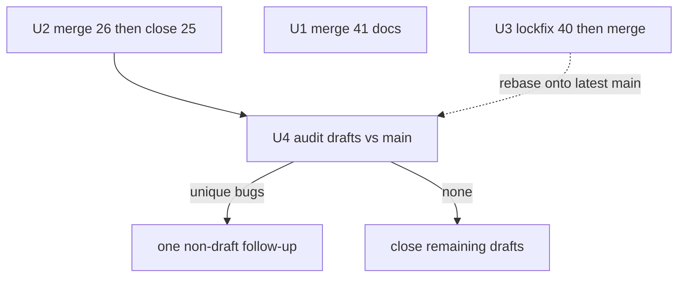

# Open PR Backlog Landing - Plan

**Target repo:** ManintheCrowds/SCP

## Goal Capsule

| Field | Value |
| --- | --- |
| Objective | Land the shippable open PRs, unblock the promptfoo Dependabot bump, and close superseded draft safety PRs without merging the overlapping bot pile. |
| Authority | Product behavior: R-IDs. Mechanism: KTDs. Units cite those IDs and do not restate them. Antigen MCP semantics: `docs/contracts/scp_antigen_mcp_v1.md`. |
| Execution profile | Work on this repo only. Do not commit `src/scp_mcp.egg-info/`. Do not open a MiscRepos PR from this plan. |
| Stop | Do not merge a change whose required check named `CI` is red. A red `CI` on `#40` is the U3 repair trigger, not a plan abort. If `#26` no longer contains the full `#25` tree, do not close `#25`; land `#25` first or rebase `#26`. Abort a follow-up that would reintroduce MCP `tls_verify`, `SCP_REGISTRY_MERGE_DEV_AUTO` on MCP, auto-merge on fetch, or MCP-expanded host allowlists. |
| Tail ownership | After this plan is implementation-ready, the LFG caller owns `ce-work` through ship on this repo. |

---

## Product Contract

### Summary

Nineteen open PRs are sitting on this repo.
Four are non-draft.
Fifteen are overlapping Cursor-bot drafts about registry, fetch, Nostr, MCP, and sanitizer safety.
The operator asked LFG to process that list.
This plan lands the green human PRs, repairs the blocked Dependabot PR, and replaces the draft pile with at most one reviewed follow-up.

### Problem Frame

Unmerged AppSec and contract work does not protect `main`.
Merging every draft would collide on the same modules and can regress fail-closed fetch, quota accounting, or MCP contract pins.

### Requirements

- R1. Merge PR `#41` so `docs/INTEGRATION.md` Complementary Controls names Windows host trust (Defender / SmartScreen / WDAC or AppLocker) and keeps process kill out of SCP MCP.
- R2. Land the layout-aware quarantine quota and antigen MCP v1.3 pin by merging PR `#26`, then close PR `#25` as superseded.
- R3. Do not merge PR `#40` until the required check named `CI` is green after a lockfile that `npm ci` can install.
- R4. Do not merge draft PRs `#23`–`#24` and `#27`–`#39` as a pile. Land unique remaining bugs in one non-draft follow-up, then close the rest with a comment naming the survivor and the audit result.
- R5. Follow-up code must not reintroduce MCP `tls_verify`, `SCP_REGISTRY_MERGE_DEV_AUTO` on MCP, auto-merge on fetch, or host allowlists expanded by MCP.
- R6. Executor changes and GitHub merges happen in this repo. Dirty local `src/scp_mcp.egg-info/*` stays uncommitted.

### Actors

- A1. Human operator — merge gate; no GitHub auto-merge.
- A2. CI — required context is the aggregate job named `CI` in `.github/workflows/ci.yml`.

### Key Flows

- F1. Merge `#26` then close `#25`. Land `#41` independently. Repair and land `#40` in parallel, rebasing onto latest `main` before merge. Audit drafts only against post-`#26` `main`.
- F2. If the audit finds no unique bug, close drafts without a follow-up PR.

### Acceptance Examples

- AE1. Covers R1. After `#41`, Complementary Controls has three bullets, including Windows host trust, and no new MCP tools.
- AE2. Covers R2. After `#26`, `layout_subdirs` is required on quota helpers and `EXPECTED_SCP_ANTIGEN_MCP_V1_SHA256` matches the vendored v1.3 file. `#25` is closed, not merged.
- AE3. Covers R3. `examples/promptfoo` installs with `npm ci` and `promptfoo-eval` plus job `CI` succeed.
- AE4. Covers R4. Zero draft Cursor-bot PRs remain open. Each close comment names the survivor and the audit result (unique hunks ported, or no unique diff vs post-`#26` `main`). At most one new non-draft follow-up exists.

### Success Criteria

Protection bar (must ship this batch): `main` contains `#26`; `#25` is closed superseded; follow-up does not violate R5.
Backlog bar: `#41` on `main`; `#40` merged or replaced by an equivalent green lockfile PR; draft pile closed or reduced to one reviewed follow-up.
Required check `CI` is green on each landed change. That job is the merge gate only. AppSec regressions remain local until the deferred CI expansion.

### Scope Boundaries

In scope: merge/close of the listed PRs, lockfile repair for promptfoo 0.122.2, one consolidated follow-up for unique draft diffs vs post-`#26` `main`.

Out of scope: new MCP tools, process-kill APIs, unifying antigen fetch with registry fetch, promptfoo config rewrite unless eval fails after lock sync, MiscRepos harness work.

### Deferred to Follow-Up Work

Expand CI beyond `tests/test_mcp_contract_v1.py` plus promptfoo so AppSec regressions always run on GitHub.
Reconcile `docs/ANTIGEN_P1_NOSTR.md` older relay-default wording with v1.3 fail-closed relays.

---

## Planning Contract

### Assumptions

Pipeline defaults (no user confirmation this run):

- Merge `#26` alone rather than `#25` then `#26`, because `#26` already contains the `#25` tree.
- Close `#25` only after `#26` is on `main`, and only after the full `#25` tree is still a subset of `#26`.
- Fix `#40` by regenerating `examples/promptfoo/package-lock.json` for 0.122.2. Do not rewrite `promptfooconfig.yaml` unless eval still fails after a clean `npm ci`.
- Prefer editing the Dependabot branch over opening a duplicate bump PR, unless Dependabot overwrites the lockfix.
- Audit baseline is `main` after U2. Newest unique candidate observed in research is PR `#39` projection-bucket preservation. Sanitizer and fetch drafts still get a unique-hunk check; `#39` is not sufficient evidence to close them unread.
- Squash merge is acceptable. No release tag is required for this batch.
- "CI green" means the aggregate job named `CI`, not leaf jobs alone.

### Key Technical Decisions

- KTD1. Treat `#26` as the single AppSec+contract landing. Governs R2. Merging both `#25` and `#26` is redundant and races close-vs-merge. Confirm with a full-PR subset check, not quarantine files only.
- KTD2. Repair the Dependabot lockfile instead of merging a red `#40` or dropping the bump. Governs R3. Precedent is PR `#18` regenerating the promptfoo lock.
- KTD3. Close overlapping drafts after a unique-diff audit. Governs R4. Blind-merge risks conflicting quota APIs, egg-info noise, and sanitize/promptfoo probe drift. Main already absorbed related AppSec via `#22`.
- KTD4. Extra local AppSec pytest is required before merging code-touching units. Governs R2 and R4. GitHub `CI` does not run `tests/test_security_regressions.py`.
- KTD5. Agent-native planning is not material for this landing. No new MCP tools or agent loops. That non-goal lives in Scope Boundaries and AE1. R5 is the U4 ban list, not this KTD.

### High-Level Technical Design

### Sequencing

U1 is independent of U2.
U2 must precede U4.
U3 may run in parallel with U2 if the lockfix branch is rebased onto the latest `main` before merge.
U4 must wait until U2 is on `main` so unique diffs are not re-fixing `#26`.

### Implementation Constraints

Honor `docs/contracts/scp_antigen_mcp_v1.md` and fetch≠merge / consent≠host-trust in `docs/SCP_R4_FETCH_REGISTRY.md` and `docs/SCP_R6_PRIVACY_CONSENT.md`.
Do not commit egg-info.
Do not enable GitHub auto-merge.

---

## Implementation Units

### U1. Land Windows host-trust docs

**Goal:** Merge PR `#41` so Complementary Controls documents Windows host trust without new MCP runtime APIs.
**Requirements:** R1, AE1
**Dependencies:** none
**Files:** `docs/INTEGRATION.md`
**Approach:**
1. Confirm the PR still changes only `docs/INTEGRATION.md`.
2. Confirm required check `CI` is green.
3. Merge with the repo's normal human merge path.
**Patterns to follow:** Existing Complementary Controls bullets for NemoClaw and Docker in the same section.
**Test scenarios:**
- Happy path: Complementary Controls lists three bullets including Windows host trust.
- Non-goal: no new MCP tool names and no process-kill API in the diff.
**Test expectation:** none for new tests — docs-only.
**Verification:** `#41` is merged. `docs/INTEGRATION.md` on `main` contains the Windows host-trust bullet.

### U2. Land antigen v1.3 and layout quota via `#26`

**Goal:** Put `#26` on `main` and close `#25` as superseded.
**Requirements:** R2, R6, AE2
**Dependencies:** none
**Files:** `docs/contracts/scp_antigen_mcp_v1.md`, `tests/test_contract_document_hash.py`, `tests/test_mcp_contract_v1.py`, `.gitattributes`, `src/scp/quarantine_limits.py`, `src/scp/scp_utils.py`, `tests/test_security_regressions.py`, `docs/QUARANTINE_LIFECYCLE.md`, `README.md`
**Approach:**
1. Diff the full `#25` tree against `#26`. Proceed with KTD1 only if `#26` still contains every `#25` change. If not, land `#25` first or rebase `#26`. Do not close `#25`.
2. Re-run the Verification Contract U2 pytest command per KTD4 before merge.
3. Merge `#26`. Close `#25` with a comment that `#26` is the survivor.
**Patterns to follow:** Required `layout_subdirs` on quota helpers in `src/scp/quarantine_limits.py`. Hash pin in `tests/test_contract_document_hash.py`.
**Execution note:** Characterization already exists on the `#26` branch. Prefer those regressions over writing a second quota design.
**Test scenarios:**
- Covers AE2. Omitting `layout_subdirs` raises `TypeError`.
- Repeated `registry_fetch/` writes count toward `SCP_QUARANTINE_MAX_TOTAL_BYTES`.
- Vendored antigen contract SHA matches `EXPECTED_SCP_ANTIGEN_MCP_V1_SHA256`.
**Verification:** `#26` merged. `#25` closed. Local pytest from the Verification Contract U2 command passes. Required check `CI` green on the merge commit.

### U3. Unblock promptfoo 0.122.2 lockfile

**Goal:** Make `#40` installable with `npm ci` and merge it once job `CI` is green.
**Requirements:** R3, AE3
**Dependencies:** none vs U1. Rebase onto `main` after U2 if needed.
**Files:** `examples/promptfoo/package.json`, `examples/promptfoo/package-lock.json`, `examples/promptfoo/promptfooconfig.yaml` (read; change only if eval still fails after lock sync), `docs/LEARNINGS_PROMPTFOO.md` (read)
**Approach:**
1. Check out `dependabot/npm_and_yarn/examples/promptfoo/promptfoo-0.122.2`.
2. Use Node 22 to match `.github/workflows/ci.yml`.
3. In `examples/promptfoo`, regenerate `package-lock.json` so `npm ci` succeeds. Do not leave comments that trigger Dependabot recreate while the lockfix is in flight.
4. Run the existing promptfoo eval config unchanged.
5. If eval fails for a semantic reason, stop and pin or document. Do not force-merge.
6. Push the lockfix. Merge when required check `CI` is green.
**Patterns to follow:** PR `#18` lock regeneration. Windows path lesson in `docs/LEARNINGS_PROMPTFOO.md` (do not regress to 0.119.x).
**Execution note:** This is packaging. Proof is install plus eval, not new Python tests.
**Test scenarios:**
- Happy path: `npm ci` in `examples/promptfoo` succeeds with the new lock.
- Happy path: `npx promptfoo eval -c promptfooconfig.yaml` matches current CI expectations.
- Failure: if eval fails after lock sync, do not merge; report the eval error.
**Verification:** `#40` merged or replaced by an equivalent green PR. Job `CI` success on that head.

### U4. Audit drafts and close or consolidate

**Goal:** Leave at most one non-draft follow-up for unique bugs; close the rest.
**Requirements:** R4, R5, AE4
**Dependencies:** U2
**Files:** for the `#39` candidate, `src/scp/pattern_record.py` and `tests/test_pattern_record_r1.py`. Also any unique files from `#23`–`#38` vs post-U2 `main`, especially `src/scp/sanitize_input.py` and `src/scp/registry_fetch.py`. Do not add `src/scp_mcp.egg-info/*`.
**Approach:**
1. Diff each draft against post-U2 `main`. Deduplicate across drafts.
2. Research observed `#39` as a unique projection-bucket preservation candidate (`semantic_aliases` / `mythic_framing`). Re-verify after U2. Do not treat that candidate as enough to close sanitizer or fetch drafts unread.
3. If unique behavior remains, open one non-draft PR with tests. Keep antigen fetch and registry fetch as separate modules.
4. Close every superseded draft with a comment naming the survivor and the audit result per AE4.
**Patterns to follow:** Fail-closed fetch in `src/scp/registry_fetch.py`. Existing projection tests. No egg-info commits (seen on some drafts).
**Test scenarios:**
- If `#39`-class work lands: projection buckets for `semantic_aliases` and `mythic_framing` survive overlay/apply.
- If unique hunks remain in `sanitize_input.py` or `registry_fetch.py`, port those drafts' existing regressions and require they pass.
- If `sanitize_input.py` or `examples/promptfoo` change, re-run promptfoo eval.
- Error path: corrupt or missing SSOT still fails closed.
- R5 negatives: follow-up diff does not add MCP `tls_verify`, does not honor `SCP_REGISTRY_MERGE_DEV_AUTO` under MCP, does not set fetch `merged` true, and does not add MCP parameters that expand host allowlists.
- Non-goal: follow-up does not unify antigen and registry fetch tracks.
- If no unique diffs: Test expectation: none -- close-only.
**Verification:** Draft count is zero, or exactly one reviewed non-draft follow-up remains. Close comments satisfy AE4. Before merging a follow-up, run the Verification Contract U2 pytest command.

---

## Verification Contract

Prove U2 and any U4 follow-up merge with `pytest tests/test_security_regressions.py tests/test_contract_document_hash.py tests/test_mcp_contract_v1.py -v` from a `pip install -e ".[dev]"` env.
Prove U3 with `npm ci` and `npx promptfoo eval -c promptfooconfig.yaml` in `examples/promptfoo`.
GitHub gate: workflow `.github/workflows/ci.yml` job id `CI` must succeed on every landed PR.
Gitleaks is a separate workflow and is not a substitute for job `CI`.
Do not treat leaf `contract` jobs as sufficient when `promptfoo-eval` failed.

---

## Definition of Done

Global:

- Protection bar (R2, R5) satisfied. Backlog bar (R1, R3, R4, R6) satisfied for full done; do not block `#26` on `#41` or `#40`.
- No `src/scp_mcp.egg-info/` in the diff.
- Abandoned lockfile or draft-port experiments are not left in the working tree.
- Each merged PR has required check `CI` green.

Per unit:

- U1: `#41` on `main`.
- U2: `#26` on `main`; `#25` closed superseded.
- U3: promptfoo 0.122.2 installable; `#40` or equivalent merged.
- U4: draft pile closed with AE4 close comments, with at most one follow-up PR.

---

## Risks & Dependencies

| Risk | Mitigation |
| --- | --- |
| `#26` no longer supersets `#25` | Land `#25` first or rebase. Do not close `#25` early. Do not abort U1 or U3. |
| `#40` eval fails after lock sync | Stop U3. Do not merge a red `CI` job. |
| Draft unique bug conflicts with `#26` quota API | Land U2 first. Port the unique test onto post-U2 `main`. |
| Accidental merge of a green draft | U4 closes drafts; do not mark drafts ready. |
| Executor runs in MiscRepos | Goal Capsule forbids it. |

---

## Sources & Research

- Open PR metadata for ManintheCrowds/SCP `#23`–`#41`.
- `.github/workflows/ci.yml` required job name `CI`.
- `docs/contracts/scp_antigen_mcp_v1.md`, `docs/QUARANTINE_LIFECYCLE.md`, `docs/SCP_R4_FETCH_REGISTRY.md`, `docs/SCP_R6_PRIVACY_CONSENT.md`, `docs/LEARNINGS_PROMPTFOO.md`.
- No `docs/solutions/` corpus in this repo.
- External web research was skipped: local PRs and contracts are the work.

Product Contract preservation: bootstrap plan, no upstream brainstorm.
